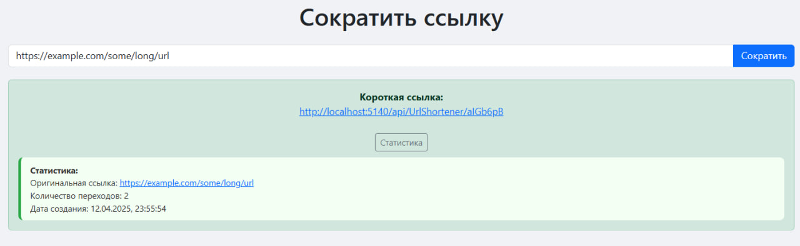

<p align ="center">
  
</p>

# URL Shortener

**Описание:**
Проект представляет собой сервис для сокращения URL. Он позволяет пользователям вводить длинные URL-ссылки, получать их короткие версии и отслеживать статистику использования этих ссылок, включая количество переходов.

## Основные функции:
- **Сокращение URL**: позволяет пользователям вводить длинные URL-ссылки и получать короткие версии.
- **Статистика**: пользователи могут просматривать статистику для каждой сокращенной ссылки, включая количество кликов и дату создания.
- **История ссылок**: сервис хранит информацию о сокращенных ссылках в базе данных.

## Технологии:
- **ASP.NET Core**: для создания веб-приложения.
- **Entity Framework Core**: для работы с базой данных.
- **SQL Server**: для хранения данных о сокращенных ссылках и их статистике.
- **Bootstrap 5**: для создания адаптивного и красивого интерфейса.
- **JavaScript**: для взаимодействия с API и отображения статистики.

## Как запустить:
1. Клонируйте репозиторий:
   ```bash
   git clone https://github.com/your-username/URLShortener.git
2. Перейдите в каталог проекта:
   ```bash
   cd URLShortener
3. Восстановите зависимости:
   ```bash
   dotnet restore
4. Выполните миграции базы данных:
   ```bash
   dotnet ef database update
5. Запустите приложение:
   ```bash
   dotnet run

## Использование:
- Введите длинную URL-ссылку в поле ввода.
- Нажмите на кнопку "Сократить", чтобы получить короткую ссылку.
- Чтобы просмотреть статистику для сокращенной ссылки, нажмите на кнопку "Статистика".

## Примечания:
- Проект использует SQL Server для хранения данных. Убедитесь, что у вас есть доступ к базе данных SQL Server или настройте свою среду.
- Для разработки и тестирования используйте ASP.NET Core с Entity Framework Core.
- Все запросы API обрабатываются с помощью JavaScript и взаимодействуют с сервером через RESTful API.
